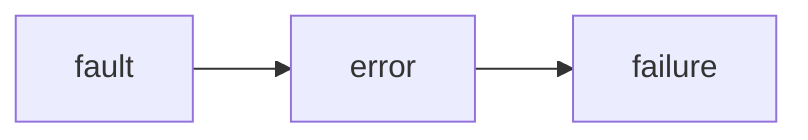

# Dependability
Not the same as reliability.
The term “dependable systems”, along with the related notions,
belongs to the general scope of systems engineering, not just to
computational systems—let alone distributed ones.
**In the context of distributed computing , dependability refers to the
==ability of a distributed system to provide correct services== to its users
despite the many different threats**.

In order to talk about dependability we must first model a **distributed system and its threats**.

## State of a system

A distributed system is designed to provide a set of ==services== to its users (clients), each service has an ==interface== that a client could use to request the service.
At each moment in time a system is in a given ==state==.
The **state of a distributed system** is determined _collectively_ by the state of the processes and threads in the system.
Part of the state might become, either implicitly or explicitly, visible through user interaction:
- The part of the state that is visible via user interaction is called ==external state==
- The remaining part is called ==internal state==.

Generally speaking, the ==state of a system== at time $t$ is represented by the minimum amount of information that, along with the knowledge about the dynamics of a (deterministic) system, allows an observer to completely describe the future system behavior -- from time $t$ onward.

The state can be used for **recovery** after a failure.

Capturing the state of a distributed system at time $t$:
- We should define the ==boundary== of a system, that is the physical / logical line that separates the system from its surrounding environment
	- Inside the boundary we find the system's components
	- Outside the boundary we find the system's environment
The tern environment refers to all other systems that the current system interacts with.

## Threat models

When a system is not compliant with its functional specification, we say that a ==failure== has occurred.
The failure of a system is caused by (part of) its state having wrong values -- i.e. ==errors== in its state.
The causal model assumes that errors are caused by some ==faults==. The _threats_ to dependability are modeled in terms of different sorts of faults.

A fault might be **dormant**, that is, it could not immediately show itself, it would appear only under certain conditions; when the specific condition is met, the fault will be **activated**.
When the component interacts with other components, the error **propagates** through the system.
When the error propagates to the interface, making the service provided to a client deviate from the specification, a **service failure** occurs.

Given the typical recursive nature of system composition, the failure of one system may cause a fault in a larger system when the former constitutes a component of the latter.
This relationship between fault, error and failure is referred to as **chain of threats**.

### Sorting Faults
Faults can be classified according to different criteria:
- the source of the fault
- the intent of the fault
- the duration of the fault
- the manifestation of the fault
- the reproducibility of the fault
- the relationship of the fault with other faults

Based on their ==source==, faults can be classified as:
- ==hardware faults== if the faults are caused by the failure of hardware components
- ==software faults== if the faults are caused by software bugs
- ==operator faults== if the faults are caused by the operator of the system

Based on their ==intent==, faults can be classified as:
- ==non-malicious faults== if the faults are not caused by a person with malicious intent
- ==malicious faults== if the faults are caused by a person with intent to harm the system

Based on their ==duration==:
- ==transient faults== if the fault is activated momentarily then goes dormant again
- ==intermittent faults== if the fault occurs, vanishes of its own accord, then reappears, and so on
- ==permanent faults== if, once activated, the fault stays unless the faulty component is repaired or the source of the fault is addressed

Based on their ==manifestation==:
- ==content faults== if the faults cause the values passed on to other components to be wrong
- ==timing faults== if the faulty component either returns a reply too early or too late after receiving a request from another component

Based on their ==reproducibility==:
- ==reproducible faults== (deterministic faults) if the fault happens deterministically and can be easily reproduced
- ==nondeterministic faults== if the fault appears to happen non deterministically and is hard to reproduce

 Based on their ==relationship with other faults==:
 - ==independent faults== if there is no casual relationship between the faults
 - ==correlated faults== if the faults are casually related

### Fail-stop, fail-safe and fail-fast systems

When the system fails, it is desirable to avoid catastrophic consequences.
The consequence of the failure of a system can be alleviated by enhancing the system with dependability mechanisms such that when it fails, it stops responding to requests; such systems are called ==fail-stop systems==.

Sometimes a system is such that its failure does not cause great harm either to human life or to the environment, such systems are referred to as ==fail-safe systems==.
Usually, a fail-safe system defines a set of _safe states_.
When a fail-safe system can no longer operate according to its specification, it can transit to one of the predefined safe states.

It is often desirable for a system to halt its operation immediately when it is in an error state or encounters an unexpected condition.
The practice to ensure such a behavior is called ==fail-fast==.

## Features of Dependable systems

- availability
- reliability
- safety
- maintainability

==Availability== refers to the property that a system is ready for immediate use.
This means that availability refers to the _probability_ that a system is operating correctly at any given moment, ready to provide users with its functions.
So a _highly-available_ system is a system that is most likely to be ready and working at any given instant of time.

==Reliability== refers to the property that a system can run continuously without failure.
This means that reliability is defined in terms of a time interval, rather than of an instant.
So a _highly-reliable_ system is a system that is most likely to keep on running for a long period of time.

==Safety== refers to the ability of a system to avoid catastrophic consequences to a failure.
This is a very difficult property to be defined, and to be ensure as well.
Catastrophic refers to those states of affairs where there is no established path from fault back to normal operation.

==Maintainability== refers to how easily a failed system can be repaired.
This means that maintainability is closely related to availability, so a highly-maintainable system may also show a high degree of availability.

Availability and reliability can be used as _evaluation metrics_ for the system.
Integrity, maintainability and safety are difficult to quantify.

### Availability

Availability is a measure of the readiness of a dependable system at any point in time, its factors are:
- ==MTTF== (Mean Time To Failure): the average time until a system fails
- ==MTTR== (Mean Time To Repair): the average time needed to repair a system
- ==MTBF== (Mean Time Between Failures): MTTF + MTTR

$$ \text{Availability} = \frac{\text{MTTF}}{\text{MTTF} + \text{MTTR}} = \frac{\text{MTTF}}{\text{MTBF}} $$
The availability of a system is typically represented in terms of how the number of 9s, for example if a system claims to offer _five 9s availability_ it means it will be available with a probability of $99.999\%$.

### Reliability
Reliability is a measure of the system's capability of providing correct services _continuously for a period of time_.
It is often represented as the probability of the system to do so for a given period of time $\Delta t$:
$$ \text{Reliability} = R(\Delta t) = e^{-\lambda\Delta t} $$
dove $\lambda \in [0,\infty)$ is the _failure rate_.
Reliability is $\approx$ proportional to MTTF

### Integrity
Integrity refers to the capability of a system to protect its state from being compromised under various threats.
In dependable computing research, integrity typically translates into the consistency of server replicas, when redundancy is used.

### Maintainability
Maintainability refers to the capability of a system to evolve after it is deployed.
Once a software fault is detected, applying a repairing patch should not involve uninstalling the existing system and reinstalling an updated one.
The same patching / update mechanism may be used to add new features or improve the performance of the existing system.

### Safety
Safety means that when a system fails, it does not cause _catastrophic_ consequences.
A fail-safe system is a safe system, safety is not important for systems that don't operate in trivial environments.

## Improving Dependability

Approaches to improving the dependability of distributed systems:
- Fault ==avoidance==
- Fault ==detection & diagnosis==
- Fault ==removal==
- Fault ==tolerance==

### Fault avoidance

Fault avoidance can be achieved by building and using quality software components and hardware that are less prone to failures.
As far as software is concerned, fault avoidance aims at ensuring correct design specification and correct implementation before a distributed system is deployed, via rigorous software design and testing.

### Fault Detection & Diagnosis

Fault detection can be tricky: crash faults are trivial to detect by periodically probing each component to check its health, however components in a practical system might fail in various ways other than crashing, so probing does not always help.
If a fault is not detected, the integrity of the system cannot be guaranteed.
Once a fault is detected, _diagnosis_ is required to determine that a fault indeed has occurred, and to localize the source of the fault, i.e. pinpoint the faulty component.

### Fault removal

Once a fault is detected and localized, it should be isolated and removed from the system, then the faulty component is either repaired or replaced and reintroduced in the system.
In a distributed system, this typically requires a notion of _membership_:
- the faulty component is excluded from the system 
- the repaired component becomes part of the membership again

### Fault tolerance

Because of hardware failures, robust software itself is not enough to deliver high dependability.
Unless a system is fully stateless, simply restarting after a failure would not automatically restore its state before the failure.
Different fault tolerance techniques can be used to target different levels of dependability requirements.
For example, in applications that need high availability, but not necessarily high reliability, _logging_ and _checkpointing_  could be enough.

### Masking failure by Redundancy

The key technique for masking faults is ==redundancy==, there are three kinds of redundancy:
- ==Information== redundancy
- ==Time== redundancy
- ==Physical== redundancy

