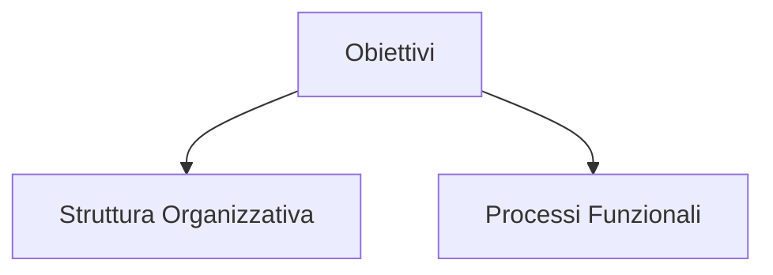
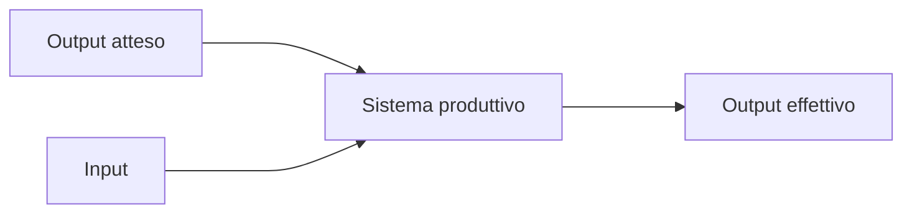

## Strutture organizzative
Ogni impresa si struttura e si organizza secondo la propria missione e per conseguire gli ==obiettivi== identificati, per fare cio' l'impresa si struttura definendo una propria ==struttura organizzativa== e un insieme di ==processi funzionali== che ne definiscono il comportamento.
Per conoscere un'azienda e' necessario conoscerne gli obiettivi, la struttura organizzativa e i processi funzionali.

La **struttura organizzativa** di un'impresa e' la sua suddivisione in unita' organizzative.
Ogni unita' organizzativa ha compiti e obiettivi specifici e collabora con le altre unita' attraverso legami di tipo gerarchico e funzionale.
 - **Divisionale** $\rightarrow$ le persone vengono raggruppate in base al prodotto o al servizio che forniscono, non al lavoro che svolgono (tipica di grandi aziende che forniscono tanti prodotti/servizi)
 - **Funzionale** $\rightarrow$ azienda piu' piccola, con poche tipologie di prodotto, raggruppa persone che svolgono compiti simili in base alla loro area di specializzazione
 - **Matrice** $\rightarrow$ ibrido, doppia rete gerarchica, tipica di aziende software house che dividono l'organizzazione per progetti

Suddivisione delle mansioni aziendali su tre livelli
- **Strategico**: si concentra sulle attivita' necessarie per garantire un posizionamento competitivo e definisce una strategia a lungo termine
- **Medio**: implementa i piani strategici definiti dal livello superiore e garantisce che le attivita' quotidiane siano conformi alla strategia aziendale
- **Operazionale**: si occupa delle operazione a breve termine, implementa beni e servizi

Il ==processo== e' l'insieme delle attivita' tra loro interrelate, finalizzate alla realizzazione di un risultato misurabile che avvicina l'azienda al raggiungimento della sua missione.

L'analisi dell'azienda come insiemi di processi determina una vista ortogonale rispetto a quella basata sulla sua organizzazione e sulle funzioni svolte dalle diverse divisioni.
I processi hanno bisogno di informazioni per poter operare, devono conoscere la risorsa su cui agiscono.
La **capacita' elaborativa** (==Information Processing Capacity==) e' l'adeguatezza di un'organizzazione rispetto alle necessita' di elaborare informazioni a essa imposte dai propri obiettivi e dal contesto in cui opera.
Il ==sistema informativo== e' formato dall'insieme delle informazioni gestite (generate, utilizzate, elaborate) dai processi aziendali e le modalita' per la loro gestione.
La porzione del sistema informativo in cui le informazioni sono gestite mediante l'uso di tecnologie informatiche costituisce il ==sistema informatico==.
I sistemi informatici sono ora elementi centrali dell'organizzazione aziendale in grado di rivoluzionare la struttura dei processi aziendali aumentando drasticamente **l'efficacia del sistema azienda**.
L'informatica e' quindi sia una tecnologia con le propie evoluzioni, sia una disciplina organizzativa.

$$
\text{Efficienza} = \frac{\text{Output Effettivo}}{\text{Input}}
$$
$$
\text{Efficacia} = \frac{\text{Output Effettivo}}{\text{Output Atteso}}
$$

Scelte direzionali $\rightarrow$ business intelligence

**Sistema informativo $\ne$ Base di Dati** (le basi di dati sono una sottoporzione del sistema informativo atta alla memorizzazione strutturata delle informazioni.)

---
## Digital transformation

Coinvolge tutti i settori aziendali pubblici e privati e mira a migliorare l'efficienza e l'efficacia delle aziende attraverso le possibilita' offerte dalle nuove tecnologie.
Il problema della digitalizzazione e' organizzativo, non solo tecnologico.
E' alimentata dalla disponibilta' dei dati.
I dati raccolti sono multimediali ed eterogenei e non piu' originati solamente dai processi aziendali.
==Small Data== $\rightarrow$ un dato abbastanza piccolo per poter essere sfruttato, ottenuti trasformando i Big Data, questa trasformazione puo' essere gestita da tecnologie ad hoc (noSql, dbms), potenza di calcolo (cluster computing), sistemi automatizzati (intelligenza artificiale).

L'adozione di nuove tecnologie segue un perscorso standard che prevede la maturazione di una o piu' tecnologie abilitanti e la loro diffusione, la prima fase e' giudata da ricercatori e ingegneri mentre la seconda da imprenditori. Questo percorso e' modellato dall'Hype Cycle di Gartner. (Trigger $\rightarrow$ Peak of inflated expectations $\rightarrow$ trough of disillusionment $\rightarrow$ slope of enlightenment $\rightarrow$ plateau of productivity)

---
## Classificazione dei SI
I SI supportano sia i processi di governo, sia i processi operativi.

==**Catena di Porter**: macroprocesso che determina la costruzione del valore di una azienda==

### SI operativi
Informatizzano processi volti all'esecuzione di attivita' o alla loro programmazione (programmazione significa pianificazione di basso livello).
Sono una *tecnologia di produzione* nei settori che "vendono" informazioni, mentre sono una *tecnologia di processo* quando il prodotto venduto e' materiale.
La loro importanza dipende dall'intensita' informativa del settore (del processo e del prodotto).
Lavorano in maniera continua.

### SI direzionali (di governo)
Supportano il controllo e il processo decisionale fornendo informazioni ai manager per assicurarsi che le attivita' operative siano conformi agli obiettivi.
Le informazioni sono estratte dalle attivita' operative e la loro elaborazione e' periodica.
Sono costruiti sopra i SI operativi da cui estraggono le informazioni.
Si basano su indici sintetici (small data).

### SI analitici (di governo)
Orientati all'esterno, analizzano processi esterni (andamento del mercato, comportamento dei clienti etc.), supportano la compressione dei fenomeni di business e sono focalizzati su prodotti, clienti e processi.
Storia del prodotto e della sua affidabilita', profilazione dei clienti e le loro abitutidi e comportamenti.

---
## Mappa dei SI
Creare una ==mappa dei SI aziendali== significa scomporli in **moduli** a fini conoscitivi e di classificazione.
Un ==modulo== rappresenta un **blocco di funzionalita' software** che supportano una fase di un processo aziendale (omogeneo per frequenza, attore e profilo di casi d'uso), esso descrive un'**esigenza informativa** e quindi indica il potenziale impiego di tecnologia informatica.
Un modulo **orizzontale** non varia al variare della tipologia aziendale, mentre un modulo **verticale** e' utilizzato in specifici settori produttivi.

### Portafoglio applicativo aziendale
*Mappa* di esigenze informative costruita prendendo le catene del valore di Porter dell'azienda e spacchettandole per tipologie di operazioni.
Ottenuto incrociando le fasi del ciclo di trasformazione con la tipologia delle attivita' applicabili per la pianificazione ed esecuzione di ciascuna fase del ciclo.
Le esigenze informative vengono implementate in moduli software standard.
- ERP
- CRM
- CIM
- CAD
